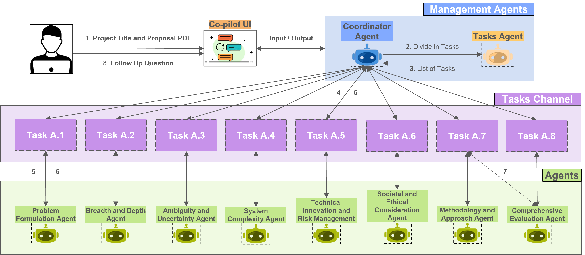

# Multi-Agent-SDP-Copliot (MASC)

### Paper: [Harnessing Multi-Agent LLMs for Complex Engineering Problem-Solving: A Framework for Senior Design Projects]()

#### Authors: [Abdullah - Information Technology University (ITU)](), [Rafay Naeem - ITU](), [Ibrahim Ghaznavi - ITU](), [Muhammad Imran Taj - Zayed University](), [Imran Hashmi - Oxford University](), [Junaid Qadir - Qatar University]()

<!-- TABLE OF CONTENTS -->
<details>
  <summary style="">Table of Contents</summary>
  <ol>
    <li>
      <a href="#about">About</a>
    </li>
    <li>
      <a href="#quickstart">Quickstart</a>
      <ul>
        <li><a href="#1-setup-the-environment">Setup the environment</a></li>
        <li><a href="#2-dependencies">Dependencies</a></li>
        <li><a href="#3-openai-api-key">OpenAI API Key</a></li>
        <li><a href="#4-evaluating-first-proposal">Evaluating first proposal</a></li>
      </ul>
    </li>
    <li>
      <a href="#user-interface">User Interface</a>
      <ul>
        <li><a href="#input-section">Input Section</a></li>
        <li><a href="#multi-agent-system-responses-and-scores">Multi-Agent System Responses and Scores</a></li>
        <li><a href="#summarized-output">Summarized Output</a></li>
        <li><a href="#agent-wise-responses">Agent-Wise Responses</a></li>
      </ul>
    </li>
    <li>
      <a href="#scores">Scores</a>
      <ul>
        <li><a href="#multi-agent-system-scores">Multi-Agent System Scores</a></li>
        <li><a href="#nlp-based-scores">NLP-based Scores</a></li>
      </ul>
    </li>
    <li><a href="#using-your-own-proposal-pdf">Using Your Own Proposal</a></li>
    <li><a href="#results">Results</a></li>
    <li><a href="#asking-followup-questions">Followup QnA with agents</a></li>
    <li><a href="#customization">Customization</a></li>
    <li><a href="#upcoming-features">Upcoming Features</a></li>
    <li><a href="#customization">Customization</a></li>
  </ol>
</details>


<div style="text-align: center;">
  <div style="display: inline-block; background-color: #f0f0f0; padding: 10px; border-radius: 10px;">
    
    <p style="color:black; font-weight: bold;">Figure 1: MASC System Design using Camel AI</p>
  </div>
</div>


## About

MASC: A **M**ulti-**A**gent LLM-based **S**enior Design Projects **C**opilot for the Engineering and Computer Science Community.

MASC is a powerful Multi-Agent-powered senior design projects/senior year capstone projects copilot. It is designed to help students, supervisors, and administrators in engineering and computer science departments at higher education institutions/universities.

MASC utilizes the [Camel AI](https://github.com/camel-ai/camel) framework to create a society of diverse GPT-4o-based agents designed to cover eight different engineering and computing project aspects. The following are the eight agents used to evaluate various aspects of the project proposals:

<ol>
    <li>Problem Formulation Agent</li>
    <li>Breadth and Depth Agent</li>
    <li>Ambiguity and Uncertainty Agent</li>
    <li>System Complexity Agent</li>
    <li>Technical Innovation and Risk Management Agent</li>
    <li>Societal and Ethical Consideration Agent</li>
    <li>Methodology and Approach Agent</li>
    <li>Comprehensive Evaluation Agent</li>
</ol>

MASC uses a multi-agent design to provide detailed feedback on each aspect of the project proposal. Once set up, it can be used by entering the title of the project and uploading a PDF file of the proposal. After processing, final scores from agents and some NLP-based scores will be displayed.


## Quickstart

### 1. Setup the Environment

MASC is built using Camel AI as a framework for the multi-agent system. We highly recommend setting up a [conda](https://docs.anaconda.com/anaconda/install/) environment as follows:

```bash
# Create a conda virtual environment
conda create --name MASC python=3.10.14

# Activate MASC conda environment
conda activate MASC
```


### 2. Dependencies

**Camel AI Installation**
```bash
# Clone CAMEL AI's github repository
git clone -b v0.2.9 https://github.com/camel-ai/camel.git

# Change directory into project directory
cd camel

# Install CAMEL from source with all the features
pip install -e '.[all]'
```

**Setting up MASC**

```bash
# Clone MASC repository
git clone https://github.com/AbdullahMushtaq78/Multi-Agent-SDP-Copliot.git

# Change directory into MASC directory 
cd Multi-Agent-SDP-Copliot

# Install all the required dependencies mentioned in the requirements.txt 
pip install -r requirements.txt
```


### 3. OpenAI API key
MASC is by default using OpenAI's GPT-4o as its backend LLM for all the agents. In order to use GPT-4o for agents, setup OpenAI API key using one of the following ways:

**Using Terminal:**
```bash
# Ubuntu/Mac
export OPENAI_API_KEY="your_api_key_here"

# Windows
setx OPENAI_API_KEY "your_api_key_here"
```

**Using Code:** In python files, like [configs.py](./configs.py) add the following code line at the top:
```python
import os
os.environ["OPENAI_API_KEY"] = "your_api_key_here"
```
_Replace "your_api_key_here" with your OpenAI API key. Use this [Quickstart Guide by OpenAI](https://platform.openai.com/docs/quickstart) to get your first api key if you do not have one._

### 4. Evaluating first proposal
This completes the setup. To run your Senior Design Project Proposal Copilot, navigate to the [Main.py](./Main.py) file and run it.

```python
# Run the Main file
python Main.py
```
Gradio will start the Copilot on local IP address: **`http://127.0.0.1:7860`**. Open your browser, enter this IP address in a new tab, and your Copilot will be ready.


## User Interface

<div style="text-align: center;">
  
  <p style="font-weight: bold;">Figure 2: User Interface design for MASC using <a href="https://github.com/gradio-app/gradio" target="_blank">Gradio</a> </p>
</div>


The user interface has the following sections:

### Input Section:
Here, users can interact with the Copilot. Enter the title of your senior design project in the **`Enter Title`** text box and upload the proposal PDF file in the **`Upload Proposal PDF`** input box. Click the **`Submit`** button, and the agents will evaluate your proposal.

A follow-up question box will also appear once the Copilot evaluates the proposal PDF.

### Multi-Agent System Responses and Scores:
After the agents complete their evaluation (usually within 300-600 seconds depending on the proposal length), their output will appear in this section. It contains:

#### Summarized Output:

This subsection provides an overall summary synthesized by the Coordinator Agent. It includes:

- Overall Score out of 5
- Evaluation Summary
- Detailed Scores and Feedback by Criterion (including strengths, weaknesses, and suggestions)
- Overall Comments


#### Agent-Wise Responses:
In order to get highly-detailed feedback based on each aspect of the proposal, this section will provide responses containing Strengths, Weaknesses and Suggestions for Imporvement from each agent separately.

### NLP-based Scores
Along with using multi-agent system to provide individual and overall scores, we also evalute the proposal using some Natural Language Processing-based metrics to extract extra insights which can play a very important role. These metrics are:
- Lexical Cohesion
- Clause Density
- Flesch-Kincaid
- Average Sentence Length

## Using your own proposal PDF
In the [Demo SDP](./Demo%20SDP/) folder, a demo senior design project proposal is provided to quickly start using MASC. Results on this demo proposal are also included, both in the form of a PDF file and with a UI (HTML, CSS, and JS) to view the results immediately. You can also upload your own proposal by entering the title, uploading the file, and clicking submit.

## Results
Once agents complete their evaluation, the responses and scores are saved as a PDF file. MASC automatically creates the following folder structure:
```
./
└── results/
        ├── TITLE_OF_PROJECT1.pdf 
        ├── TITLE_OF_PROJECT2.pdf 
        ├── ...
```
The output files are named after their project titles and saved in the **`results/`** folder. This file only contian agents' responses on propsal file excluding the followup questions and their responses. This directory can also be changed (see [Customization](#customization) for more details).

## Followup QnA with Agents
- We designed MASC to be interactive and conversational, providing a complete user experience. Students can ask questions to the agents by typing their follow-up questions in the **`Followup Question`** text box and pressing the **`Send Message`** button.  
- Based on the context and type of question, the coordinator agent in MASC will automatically determine which agents are best suited to answer the follow-up question. This makes MASC a highly dynamic multi-agent system. The responses from the agents will be displayed in the same "Multi-Agent System Responses and Scores" section, without any scores, but with detailed feedback and suggestions regarding the follow-up questions.


## Scores:

### Multi-Agent System Scores:
| **Criteria/Agents** | **Assessment** | **Score Range** |
|---------------------|-----------------|-----------|
| Problerm Formulation |Assess the clarity, depth, and scope of the problem statement:<br>* Does the proposal clearly articulate the engineering problem?<br>* Is the complexity level of the problem aligned with advanced engineering challenges?<br>* Does it highlight any interdisciplinary aspects or requirements that add to the complexity?<br>* Are the societal, environmental, or ethical implications of the problem considered in the formulation? | -/5 |
|Breadth and Depth|Evaluate the breadth (interdisciplinary aspects) and depth (in-depth analysis and specialized knowledge) required for solving the problem:<br>* Does the proposal show evidence of requiring interdisciplinary knowledge (e.g., integration of mechanical, electrical, or software engineering principles)?<br>* Are specialized techniques, theories, or methods needed for this project?<br>* Is there evidence of in-depth analysis, such as detailed background research or literature review, that supports problem formulation?| -/5 |
|Ambiguity and Uncertainity|Identify areas in the proposal where uncertainty or ambiguity is present. Assess whether the project includes uncertain elements and requires assumptions or estimations:<br>* Are there data gaps or ambiguous elements in the problem that require assumptions or approximations?<br>* Does the proposal acknowledge potential sources of uncertainty or unknown variables?<br>* How well does the project formulation plan to address and manage this ambiguity?| -/5 |
|System Complexity|Analyze the system complexity within the proposal. Evaluate whether the project involves multiple, interconnected components that add complexity:<br>* Does the problem involve managing interactions between multiple subsystems?<br>* Are there dependencies or integrations that need special attention?<br>* Is there a structured approach for managing these complex system interactions, such as a modular design or layered architecture?| -/5 |
|Technical Innovation and Risk Management|Evaluate the project's innovation level and technical unpredictability. Determine if the project aims to push boundaries with novel approaches or technologies:<br>* Does the proposal include innovative solutions or cutting-edge technology that is technically challenging?<br>* Are existing solutions insufficient, requiring new methods or adaptations?<br>* Does the project plan account for or manage technical unpredictability?| -/5 |
|Societal and Ethical Considerations|Assess the attention given to societal, environmental, and ethical factors. Verify if broader implications are acknowledged and addressed in the project:<br>* Are societal, environmental, or ethical impacts explicitly considered in the project proposal?<br>* Does the proposal outline steps to mitigate any adverse effects or ethical concerns?<br>* Is there a justification for how the project aligns with public safety, welfare, or environmental goals?| -/5 |
|Methodology and Approach|Critique the methodology and approach proposed for solving the problem. Ensure that the methodology aligns with solving complex engineering problems and leverages appropriate analytical tools:<br>* Is the proposed methodology rigorous and well-suited for handling the identified complexity?<br>* Are advanced analytical tools, simulations, or modeling approaches specified?<br>* Does the methodology account for iterative testing, prototyping, or validation against real-world conditions?| -/5 |
|Comprehensive Evaluation|Synthesize evaluations from all other agents to provide an overall score and summary. Offer a holistic assessment of the project’s formulation, analysis, and methodology:<br>* How well does the project proposal align with ABET’s definition of complex engineering problems?<br>* What are the overall strengths and weaknesses based on agent feedback?<br>* Are there any key areas for improvement identified across multiple agents?| -/5 |
| Final Score | Final score averaged across all the agents' scores | -/5 |

### NLP-based Scores:
NLP-based metrics used are:

| **Metric** | **Description** | **Score Range** |
|------------|-----------------|-----------------|
| **Lexical Cohesion** | Measures thematic consistency by analyzing word repetition or related terms, indicating how well the content in the proposal is built upon multiple ideas. | 0 (no cohesion) to 1 (full thematic consistency) |
| **Clause Density** | Captures sentence complexity by measuring clauses per sentence, reflecting layered perspectives. | 1 (simple, single-idea sentences) to 3+ (highly complex, multi-idea sentences) |
| **Flesch-Kincaid** | Estimates readability, indicating the U.S. grade level needed to understand the text for the first time. An ideal range balancing accessibility and sophistication (0–16 scale) for bachelor's-level academic purposes. | 0 to 16 (based on U.S. grade level) |
| **Average Sentence Length** | Indicates structural complexity and content depth. Shorter sentences enhance readability, while longer ones may reflect richer perspectives but harder to follow. | Shorter sentences = easier to read; Longer sentences = more complex |


# Customization
Customizable parameters for MASC.
|**Customization Area**| **Description** | **Variable to Modify** | **Possible Values** | **Location/File** |
|----------------------|-----------------|------------------------|---------------------|-------------------|
| **LLM Platform/Provider** | Change the provider of the LLM. | `PLATFORM` | `ModelPlatformType.OPENAI`, `ModelPlatformType.ANTHROPIC`, `ModelPlatformType.GEMINI`, `ModelPlatformType.GROQ`, `ModelPlatformType.MISTRAL`, `ModelPlatformType.OLLAMA`, etc. (see [Camel AI documentation](https://docs.camel-ai.org/key_modules/models.html) for more) | [configs.py](./configs.py) |
| **Large Language Model (LLM)** | Select which OpenAI's or other LLM to use for backend processing. (Using OpenAI's LLM is recommended) | `MODEL` | `ModelType.GPT_3_5_TURBO`, `ModelType.GPT_4`, `ModelType.GPT_4_TURBO`, `ModelType.GPT_4O`, `ModelType.GPT_4O_MINI`, `ModelType.O1_MINI`, `ModelType.O1_PREVIEW`, `CLAUDE_3_5_SONNET`, `GEMINI_1_5_PRO`, etc. (see [Camel AI documentation](https://docs.camel-ai.org/key_modules/models.html) for more) | [configs.py](./configs.py) |
| **Temperature** | Controls the randomness of the model’s output. A higher value results in more randomness, while a lower value makes the output more deterministic. | `TEMPERATURE` | Depends on the LLM but usually in the range of `0-2` | [configs.py](./configs.py) |
| **Names/Roles/Tools** | Customize the names, roles, and tools available to each agent in the system. | `NAMES`, `ROLES`, `__Allowed_Tools_per_Agents` | Completely customizable | [configs.py](./configs.py) |
| **Agents Personas** | Modify the specific persona of each agent, including their behavior, knowledge base, and style of interaction. | `agents_personas` | Completely customizable | [personas.py](./personas.py) |
| **Results Directory** | Specify or change the directory where the results will be stored. | `RESULTS_DIR` | Completely customizable to any directory | [configs.py](./configs.py) |
| **Data Extraction from PDF** | Customize how data is extracted from PDF documents, including handling images and text. This involves using GPT-4o-mini for image analysis. | `extract_text_with_images_from_pdf` and `analyze_image` functions | Completely customizable to any VLM or OpenAI's LLMs | [configs.py](./configs.py) |


# Citation
If you use MASC or find it useful for your research, consider citing:

```bibtex
@inproceedings{PaperName,
	title        = {---},
	author       = {---},
	year         = 2024,
	booktitle    = {---},
	series       = {---}
}
```


# Upcoming Features
<ul>
  <li>
    <input type="checkbox" id="task1">
    <label for="task1">Changing the dynamic selection of agents using coordinator agent for follow-up questions to manual selection by users using <code>@</code> in the message or a separate input section for each agent.</label>
  </li>
</ul>
 
---

### _Contributions are welcome! If you'd like to improve the project, check out the Upcoming Features section or suggest enhancements. Feel free to fork the repository, make changes, and submit a pull request._